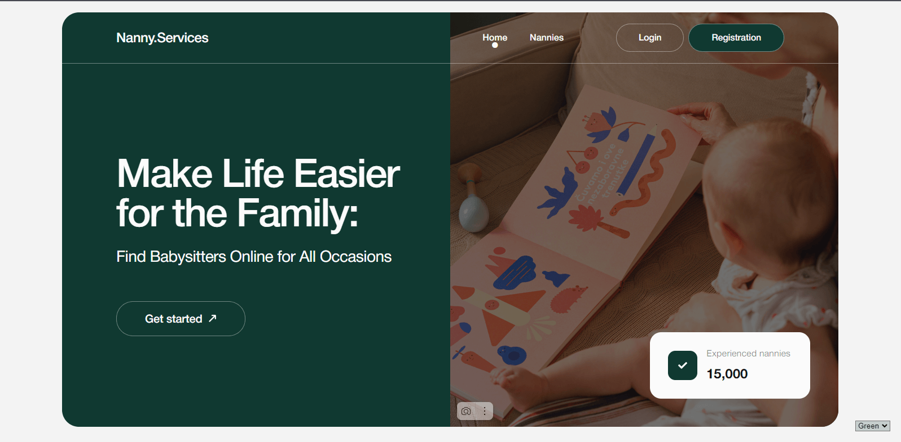
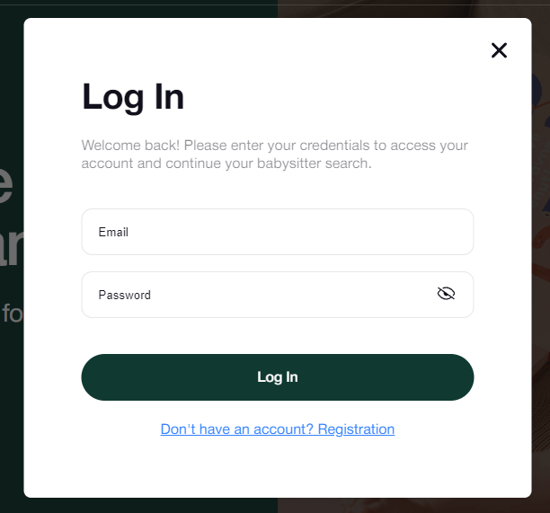
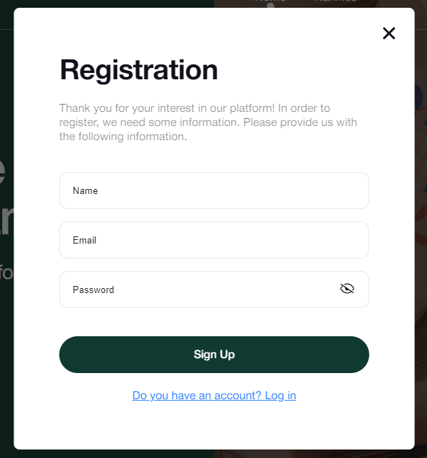
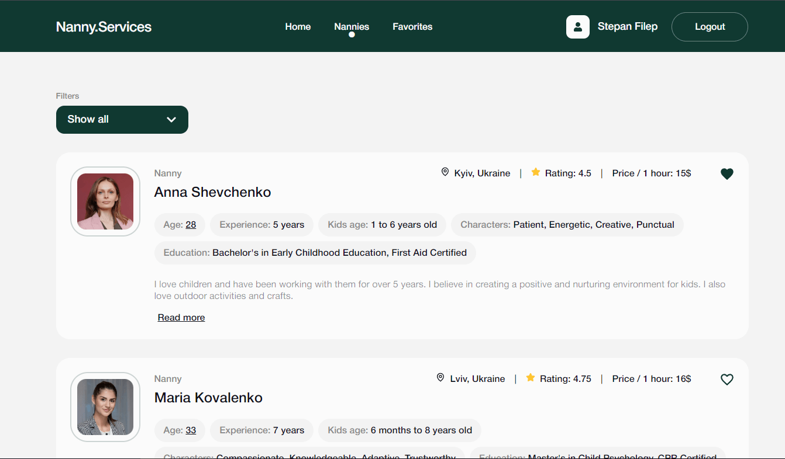

# Застосунок для послуг нянь

## Про проєкт

Цей проєкт — це веб-застосунок для компанії, яка пропонує послуги нянь. Він дозволяє користувачам переглядати доступних нянь, сортувати та фільтрувати їх за різними критеріями, а також зберігати вподобаних нянь у списку обраних. Користувачі також можуть записуватись на зустрічі з нянями через застосунок.

Застосунок складається з трьох основних сторінок:

1. **Home**: Вітальна сторінка з назвою сайту, слоганом компанії та кнопкою, що закликає розпочати роботу, і перенаправляє на сторінку "Nannies".
2. **Nannies**: Сторінка, де користувачі можуть переглядати, сортувати та фільтрувати список нянь. Також можна додавати нянь до обраних.
3. **Favorites**: Приватна сторінка, на якій відображаються няні, збережені користувачем у список обраних. Доступна тільки для авторизованих користувачів.

## Використані технології

- **Фронтенд**: React, React Router, React Hook Form, Yup
- **Бекенд**: Firebase (Realtime Database, Authentication)
- **Управління станом**: Context API
- **Стилізація**: CSS модулі
- **Деплой**: Vite

## Основні функції

- **Авторизація користувачів**: Firebase Authentication для входу та реєстрації користувачів. Форма побудована за допомогою React Hook Form і Yup для валідації.
  
  
- **Список нянь**: Дані про нянь отримуються з Firebase Realtime Database. Користувачі можуть фільтрувати їх за ціною, сортувати за ім'ям та рейтингом.
  
- **Обрані**: Авторизовані користувачі можуть додавати нянь у список обраних, який зберігається в localStorage або Firebase. Стан зберігається після оновлення сторінки.
- **Адаптивний дизайн**: Застосунок підтримує різні розміри екранів — від мобільних пристроїв (320px) до великих екранів (1440px).

## Дизайн та макет інтерфейсу

Дизайн застосунку відповідає чистому та зручному макету, заснованому на наданих прототипах. Основні компоненти:

- **Головна сторінка (Home)**: Містить основний слоган компанії, а також селектор палітри для вибору стилю.
- **Сторінка нянь (Nannies)**: Включає фільтри та систему сортування, картки нянь із короткою інформацією (ім'я, ціна, локація, рейтинг). Користувачі можуть завантажувати більше нянь під час перегляду.
- **Сторінка обраних (Favorites)**: Відображає список нянь, збережених користувачем, з можливістю видалення з обраних.
- **Користувач може змінювати головні кольори на будь-якій сторінці сайту.**

## Технічні вимоги

1. **Авторизація**:

   - Реєстрація, вхід і вихід користувача через Firebase Authentication.
   - Тільки авторизовані користувачі можуть додавати нянь до обраних.

2. **Колекція нянь**:

   - Зберігається у Firebase Realtime Database з полями: ім'я, аватар, досвід, освіта, ціна за годину, відгуки тощо.

3. **Картка няні**:

   - Кожна картка містить коротку інформацію про няню. Є можливість розгорнути картку для перегляду більш детальної інформації та відгуків.

4. **Функція "Обрані"**:
   - Вподобані няні зберігаються для авторизованих користувачів в Firebase.
5. **Маршрутизація**:

   - Використовується React Router для навігації між сторінками "Home", "Nannies" та "Favorites".

6. **Модальні вікна**:
   - Модальні вікна для входу, реєстрації та запису на зустріч побудовані з використанням React Hook Form та Yup для валідації.

## Додаткові функції

- **Збереження стану**: Дії користувача, як-от додавання нянь до обраних, зберігаються між сеансами.
- **Закриття модалок**: Модальні вікна можна закрити за допомогою кнопки, кліка по фону або натиснення клавіші "Esc".
- **Реальний час**: Дані про нянь динамічно завантажуються з Firebase з можливістю підвантаження нових карток.

## Деплой

Проєкт розгорнутий на [Vercel](https://nanny-services-app-nu.vercel.app/), що дозволяє легко отримати доступ до застосунку онлайн.

## Як почати роботу

### Попередні умови

- Встановлений npm
- Налаштований проєкт Firebase

### Інструкції з встановлення

1. Клонувати репозиторій:
   git clone https://github.com/Step004/nanny-services-app.git
2. Встановити залежності:
   npm install
3. Налаштувати Firebase:
   - Налаштуйте Firebase Authentication та Realtime Database у вашій Firebase консолі.
   - Оновіть конфігурацію Firebase у проєкті.
4. Запустити застосунок:
   npm run dev
